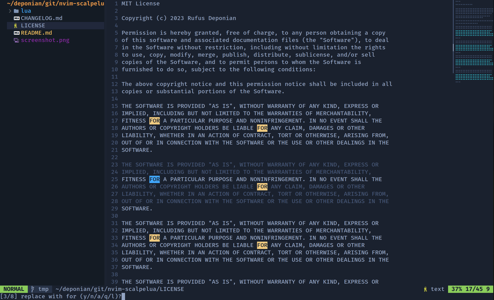

### Description

This plugin helps to replace all instances of selected sequence in the buffer in absolutely **literal** way. It doesn't use any of Vimscript search commands, so no [magic](https://neovim.io/doc/user/options.html#'magic'), no backslashes, no nothing. You replace exactly what you've selected.



### Installation

Install via your preferred package manager:
- `deponian/nvim-scalpelua`
- `deponian/mini.map` for integration with mini.map (optional) (see below)

Examples for some package managers:

#### vim-plug

```vim
Plug 'deponian/nvim-scalpelua'
Plug 'deponian/mini.map' " optional
```

#### lazy

Importing file below or directory it is contained on lazy setup.

```lua
return {
  "deponian/nvim-scalpelua",
  version = "*",
  dependencies = {
    "deponian/mini.map",
  },
  config = function()
    require("scalpelua").setup()
  end,
}
```

### Usage

Map `<Plug>(Scalpel)` to replace selected sequence or `<Plug>(ScalpelVisual)` to replace something inside selected sequence.

```lua
vim.keymap.set('v', "<leader>r", "<Plug>(Scalpel)")
vim.keymap.set('v', "<leader>R", "<Plug>(ScalpelMultiline)")
```

or

```vim
vmap <Leader>r <Plug>(Scalpel)
vmap <Leader>R <Plug>(ScalpelMultiline)
```

### Configuration

These are default options. You can run empty `require('scalpelua').setup()` if these options suit you.

```lua
require("scalpelua").setup({
  -- enable/disable integration with mini.map plugin (see below)
  minimap_enabled = false,
  -- separator between pattern and replacement in command line
  separator = "»",
  -- names of highlighting groups
  highlighting = {
    regular_search_pattern = "Search",
    current_search_pattern = "WildMenu",
    minimap_integration = "Constant",
  }
})
```

### mini.map integration

You can enable integration with [mini.map plugin](https://github.com/echasnovski/mini.map) by setting `minimap_enabled = true` in your configuration. This way you will see all found instances of the pattern in your mini.map window and it will be updated every time you replace new pattern pressing `y` key.

**Notice**: original mini.map plugin doesn't expose some internal functions that necessary during the replacement process, so I've created highly complicated [fork](https://github.com/deponian/mini.map) with three (!) new lines of code. Use it if you want to enable mini.map integration with Scalpelua plugin.

### Acknowledgements

Thanks to Greg Hurrell and his [Scalpel](https://github.com/wincent/scalpel) plugin that I've been using for the past few years.

Thanks to Evgeni Chasnovski and his great [mini.map](https://github.com/echasnovski/mini.map) plugin.
